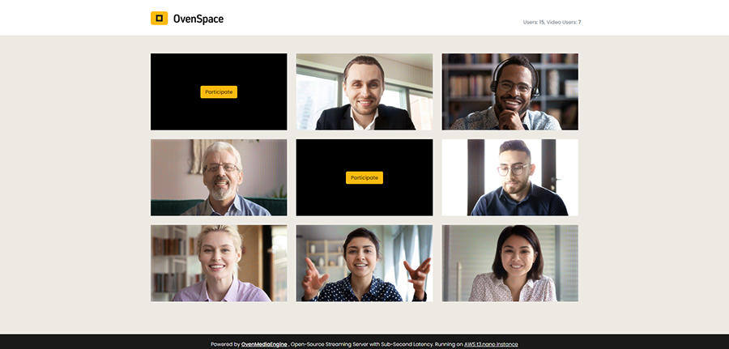
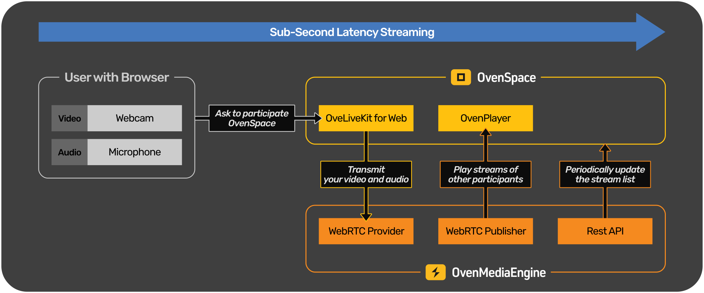

# "Web Video Conferencing with OvenMediaEngine" OvenSpace

## What is OvenSpace?


In short, OvenSpace can make Web Video Conferencing with OvenMediaEngine, Open-Source Streaming Server with Sub-Second Latency.

OvenSpace is basically built with [OvenMediaEngine](https://github.com/AirenSoft/OvenMediaEngine) as a Streaming Server and [OvenPlayer](https://github.com/AirenSoft/OvenPlayer) as an HTML5 Player. So everyone can easily build a more reliable conference call, video chat, and meeting system on the web using our open-source projects.

Please visit the **[OvenSpace Demo](https://space.ovenplayer.com/)** and start web video conferencing.

### Overview


You use your Webcam as video and your Microphone as audio to send a media stream to OvenSpace through a browser that supports WebRTC, [**OvenLiveKit for Web**](https://github.com/AirenSoft/OvenLiveKit-Web) in OvenSpace sends your stream to **WebRTC Provider** in OvenMediaEnigne for instant connection.

And **WebRTC Publisher** in OvenMediaEngine sends other people's streams for playing on **OvenPlayer** in OvenSpace, and you can participate in web video conferencing with sub-second latency. Also, the stream list of OvenSpace is periodically updated through the **Rest API** provided by OvenMediaEngine.

## What is the goal of this project?
AirenSoft aims to make it easier for you to build a stable broadcasting/streaming service with Sub-Second Latency.
Therefore, we will continue developing and providing the most optimized tools for smooth Sub-Second Latency Streaming.

Would you please click on each link below for details:
* ["Live Streaming Encoder for Mobile" **OvenLiveKit SDK**](https://www.airensoft.com/olk)
* ["Sub-Second Latency Streaming Server" **OvenMediaEngine**](https://www.ovenmediaengine.com/ome)
* ["HTML5 Player" **OvenPlayer**](https://www.ovenmediaengine.com/ovenplayer)

## Features
- Can Instantly start Web Video Conferencing with Sub-Second Latency.
- Available on desktop and mobile browsers without plugins.
- Can configure to use your own OvenMediaEngine.

## Installation
OvenSpace installation is described below.

### Requires Python 3.6 or higher
OvenSpace can run using the [Flask](https://flask.palletsprojects.com/en/2.0.x/) web framework in a Python 3.6+ environment. However, if your operating system does not have Python 3.6 or later installed, you need to install it.

### Install OvenSpace
Clone the repository and navigate into the project directory
```
$ git clone https://github.com/AirenSoft/OvenSpace.git && cd OvenSpace
```
Create a virtual environment for Python. Make sure you are using Python 3.6 or a higher version, and activate the virtual environment. A detailed explanation is [here](https://docs.python.org/3.6/library/venv.html#creating-virtual-environments).
```
$ python -m venv venv
$ source venv/bin/activate
```
Install all required Python modules for OvenSpace.
```
(venv) $ pip install -r requirements.txt
```

This completes the OvenSpace installation. 

Check out the [Quick Start](#quick-start) section below to get started with OvenSpace for development or testing.

## Quick Start

### Launch OvenMediaEngine using docker
You can use `Server_no_tls.xml` to run OvenMediaEngine with docker with the command below in the project directory.
```
$ docker run -d -p 3333:3333 -p 3478:3478 -p 8081:8081 -p 10006-10010:10006-10010/udp -v $PWD/Server_no_tls.xml:/opt/ovenmediaengine/bin/origin_conf/Server.xml airensoft/ovenmediaengine:latest
```

### Launch OvenSpace
Start OvenSpace using the preset [`ovenspace.cfg`](./ovenspace.cfg) for OvenMediaEngine running with the Docker above. OvenSpace runs on the built-in development server of Flask.
```
(venv) $ python OvenSpace.py
```
You can check the OvenSpace running at http://localhost:5000. 

> This quick start is a simple method for testing and development purposes. Running OvenSpace in a real environment is described in the [Deploy OvenSpace](#deploy-ovenspace).

## Configuration
### OvenSpace Configuration
The `ovenspace.cfg` file allows you to configure the settings needed to connect with the OvenMediaEngine from the OvenSpace.
The settings are as follows:
```python
OME_HOST = 'your.oven_media_engine.com'

OME_API_ENABLE_TLS = 'true'
OME_API_PORT = '8082'
OME_API_ACCESS_TOKEN = 'your_api_access_token'

OME_VHOST_NAME = 'default'
OME_APP_NAME = 'app'
OME_STREAM_NAME = 'stream'

OME_WEBRTC_PROVIDER_ENABLE_TLS = 'true'
OME_WEBRTC_PROVIDER_PORT = '3333'

OME_WEBRTC_PUBLISHER_ENABLE_TLS = 'true'
OME_WEBRTC_PUBLISHER_PORT = '3333'
```
#### `OME_HOST`
Set the OvenMediaEngine's domain or IP address. For a TLS connection, set the domain.
#### `OME_API_ENABLE_TLS`
`'true'` or `'false'`. Determines whether to use TLS when calling OvenMediaEngine's [REST API](https://airensoft.gitbook.io/ovenmediaengine/rest-api#setting-up-for-using-the-apis).
#### `OME_API_PORT`
Sets the [port of OvenMediaEngine's REST API Server](https://airensoft.gitbook.io/ovenmediaengine/rest-api#port). If you set `OME_API_ENABLE_TLS` to `'true'` use  the `TLSPort` of OvenMediaEngine API Server.
#### `OME_API_ACCESS_TOKEN`
Sets the [token to be used for authentication](https://airensoft.gitbook.io/ovenmediaengine/rest-api#host-and-permissions) when calling the OvenMediEngin REST APIs.
#### `OME_VHOST_NAME`
Sets the [virtual host](https://airensoft.gitbook.io/ovenmediaengine/configuration#virtual-host) of OvenMediaEngine that OvenSpace will use.

#### `OME_APP_NAME`
Sets the [application name](https://airensoft.gitbook.io/ovenmediaengine/configuration#application) of OvenMediaEngine that OvenSpace will use.

#### `OME_STREAM_NAME`
Sets the stream name that OvenSpace will use to send or receive streams to the OvenMediaEngine. If `OME_STREAM_NAME` is set to `'stream-'`, OvenSpace sends and receives streams in the format `'stream-0'`, `'stream-1'`, `'stream-2'`.

#### `OME_WEBRTC_PROVIDER_ENABLE_TLS`
`'true'` or `'false'`. Determines whether to use TLS when signalling with OvenMediaEngine's [WebRTC Provider](https://airensoft.gitbook.io/ovenmediaengine/live-source/webrtc-beta).

#### `OME_WEBRTC_PROVIDER_PORT`
Sets the [signalling port of WebRTC Provider](https://airensoft.gitbook.io/ovenmediaengine/live-source/webrtc-beta#bind). If you set `OME_WEBRTC_PROVIDER_ENABLE_TLS` to `'true'` use  the `TLSPort` of  [WebRTC Provider](https://airensoft.gitbook.io/ovenmediaengine/live-source/webrtc-beta).

#### `OME_WEBRTC_PUBLISHER_ENABLE_TLS`
`'true'` or `'false'`. Determines whether to use TLS when signalling with OvenMediaEngine's [WebRTC Publisher](https://airensoft.gitbook.io/ovenmediaengine/streaming/webrtc-publishing).

#### `OME_WEBRTC_PUBLISHER_PORT`
Sets the [signalling port of WebRTC Publisher](https://airensoft.gitbook.io/ovenmediaengine/streaming/webrtc-publishing#configuration). If you set `OME_WEBRTC_PUBLISHER_ENABLE_TLS` to `'true'` use  the `TLSPort` of  [WebRTC Publisher](https://airensoft.gitbook.io/ovenmediaengine/streaming/webrtc-publishing).

### OvenMediaEngine Configuration
When not using TLS, the minimum settings of OvenMediaEngine's `Server.xml` required for OvenSpace is: [Server_no_tls.xml](./Server_no_tls.xml)

## Deploy OvenSpace
When trying to use OvenSpace in the real world, browsers only allow access to user devices such as webcams when they have a secure connection, so OvenSpace must be serviced over HTTPS. 

If OvenSpace is serviced with HTTPS, of course, signaling with OvenMediaEngine must also use TLS. This section describes how to service OvenSpace with HTTPS using NGINX and TLS settings for OvenMediaEngine.

> To serve OvenSpace over HTTPS, we need a domain name and SSL certificate.

### Setting TLS on OvenMediaEngine
We need to make OvenMediaEngine's REST API Server, WebRTC Provider, and WebRTC Publisher work with TLS. You may find it helpful to refer to this  [manual](https://airensoft.gitbook.io/ovenmediaengine/streaming/tls-encryption) and links of [OvenSpace configuration](#ovenspace-configuration).

After all the minimal setting of OvenMediaEngine's Server.xml will look like [Server.xml](./Server.xml)

### Launch OvenSpace (Advanced)
In the Quick Start section. We used Flask's built-in development server to run OvenSpace. 

When deploying OvenSpace, WSGI HTTP Server called [Gunicorn](https://gunicorn.org/) is used in consideration of performance. Gunicorn is installed while installing OvenSpace.

You can run OvenSpace on Gunicorn with this command.
> Don't forget to set `OME_API_ENABLE_TLS`, `OME_WEBRTC_PROVIDER_ENABLE_TLS`, `OME_WEBRTC_PUBLISHER_ENABLE_TLS` to `'true'` in `ovenspace.cfg`.
```
$ source venv/bin/activate
(venv) $ gunicorn --bind 0.0.0.0:5000 --worker-class eventlet -w 1 --threads 1 OvenSpace:app
```
Or execute [`run.sh`](./run.sh) script. This script runs gunicorn as a background process.

### Nginx Setup
We will set up SSL certification on Nginx and have Nginx forward all requests to OvenSpace.

```
server {
    listen       443 ssl;
    server_name  www.yourdomain.com;

    ssl_certificate /your/path/to/cert_file.crt;
    ssl_certificate_key /your/path/to/key_file.key;
    ssl_protocols TLSv1 TLSv1.1 TLSv1.2;
    ssl_prefer_server_ciphers   on;

    # Forward all requests to OvenSpace.

    location / {
        proxy_pass http://127.0.0.1:5000;
    }

    location /socket.io {
        proxy_http_version 1.1;
        proxy_buffering off;
        proxy_set_header Upgrade $http_upgrade;
        proxy_set_header Connection "Upgrade";
        proxy_pass http://127.0.0.1:5000/socket.io;
    }
}

# Redirect http request to https
server {
    listen       80;
    server_name  www.yourdomain.com;

    rewrite ^(.*) https://www.yourdomain.com$1 permanent;
}
```
Once everything is set up, you can see the OvenSpace running at `https://www.yourdomain.com`, and the deployment is complete.

## For more information
* [OvenSpace Demo](http://space.ovenplayer.com/)
  * Conference call/video chat demo using OvenMediaEngine, OvenPlayer, and OvenLiveKit for Web.
* [OvenMediaEngine Website](https://ovenmediaengine.com) 
  * Basic Information, FAQ, and Benchmark about OvenMediaEngine.
* [OvenMediaEngine GitHub](https://github.com/AirenSoft/OvenMediaEngine)
  * Open-Source Streaming Server with Sub-Second Latency.
* [OvenMediaEngine Tutorial](https://airensoft.gitbook.io/ovenmediaengine/)
  * Getting Started, Install, and Configuration.
* [OvenPlayer GitHub](https://github.com/AirenSoft/OvenPlayer)
  * Open-Source HTML5 Player.
* [OvenPlayer Tutorial](https://airensoft.gitbook.io/ovenplayer)
  * Initialization, UI Customize, and APIs.

## License
OvenSpace is licensed under the [MIT](./LICENSE) license.
